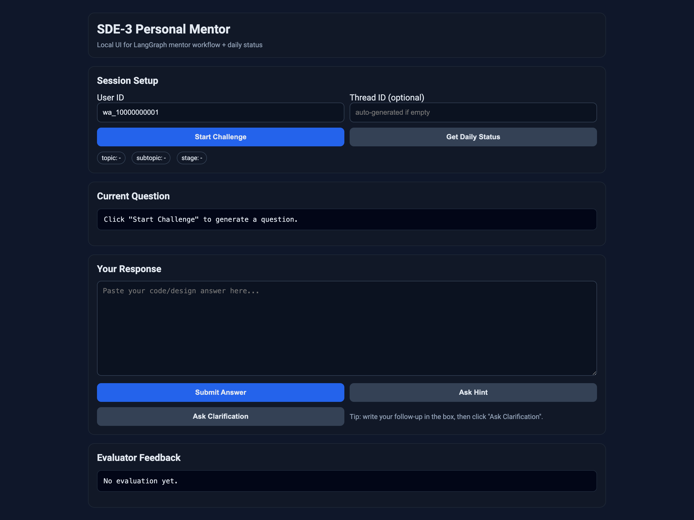
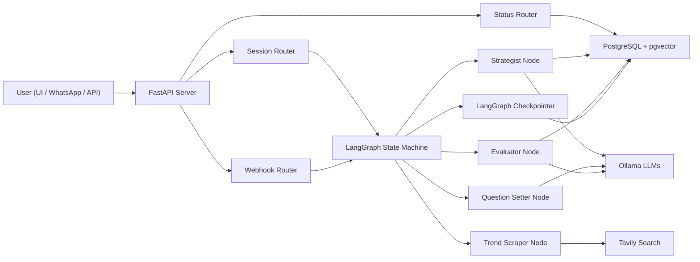
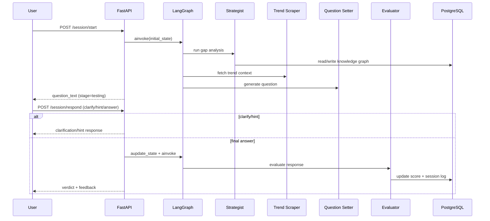
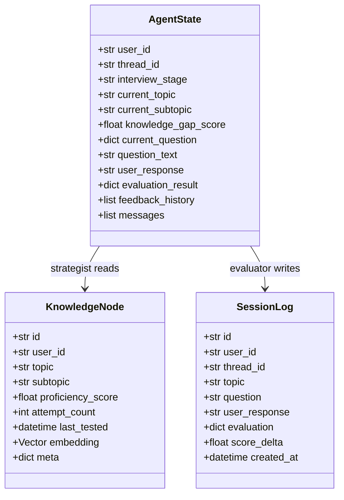

# SDE-3 Personal Mentor Agent

An AI mentor system for advanced DSA + System Design preparation, built as a **stateful multi-agent workflow** on **LangGraph**, served via **FastAPI**, persisted in **PostgreSQL + pgvector**, and runnable with **local Ollama models** (no paid API required).

---

## Table of Contents

- [1. Project Vision](#1-project-vision)
- [2. Key Features](#2-key-features)
- [3. UI Preview](#3-ui-preview)
- [4. Functional Requirements](#4-functional-requirements)
- [5. Non-Functional Requirements](#5-non-functional-requirements)
- [6. Architecture Overview (HLD)](#6-architecture-overview-hld)
- [7. Detailed Design (LLD)](#7-detailed-design-lld)
- [8. UML / Sequence / Class Diagrams](#8-uml--sequence--class-diagrams)
- [9. Data Model](#9-data-model)
- [10. API Endpoints](#10-api-endpoints)
- [11. WhatsApp Command Guide](#11-whatsapp-command-guide)
- [12. Local Setup](#12-local-setup)
- [13. Runbook](#13-runbook)
- [14. Testing](#14-testing)
- [15. Troubleshooting](#15-troubleshooting)
- [16. Security Notes](#16-security-notes)
- [17. Suggested Next Improvements](#17-suggested-next-improvements)
- [18. Repository Structure](#18-repository-structure)

---

## 1. Project Vision

This project targets the final 10% gap for experienced engineers preparing for Staff-level interviews.

It provides:
- Personalized topic selection from your knowledge graph
- Trend-aware question generation
- Strict evaluator feedback (complexity, concurrency, distributed systems, fintech rigor)
- Continuous progress memory across sessions
- API, UI, and WhatsApp entry points

---

## 2. Key Features

- **LangGraph orchestration** with checkpointed state and resumable interview flow
- **Four-agent design**:
  - Strategist (gap analysis)
  - Trend Scraper (market/interview trends)
  - Question Setter (custom challenge generation)
  - Evaluator (senior-level grading)
- **Ollama-first LLM mode** for personal, low-cost/local execution
- **Session APIs** for start/respond/history/state
- **Daily status tracking** via REST and WhatsApp command (`status`)
- **Interactive local UI** at `/`
- **Mock webhook** for end-to-end testing without Twilio

---

## 3. UI Preview

> Local screenshot preview (from attached asset):



> For GitHub rendering, copy this image into the repo (example: `docs/images/ui-preview.png`) and update this path.

---

## 4. Functional Requirements

1. System must generate personalized interview questions per user.
2. User can ask hints and clarifications before solution submission.
3. User can submit final answer and receive structured evaluator feedback.
4. System must persist session context and feedback history.
5. System must expose REST APIs and webhook integrations.
6. System must provide daily status summary (attempts, score trend, latest verdict).

---

## 5. Non-Functional Requirements

- **Latency**: challenge generation should be interactive (typically < 30s on local models).
- **Resilience**: checkpointer fallback chain (Postgres -> SQLite -> Memory).
- **Extensibility**: modular node/prompt design for agent evolution.
- **Security**: `.env` secrets excluded via `.gitignore`.
- **Portability**: Dockerized Postgres + local Python runtime.

---

## 6. Architecture Overview (HLD)



---

## 7. Detailed Design (LLD)

### 7.1 Request/State Lifecycle

1. `POST /session/start` initializes `AgentState` and invokes graph:
   - `strategist -> scraper -> question_setter -> END(testing state)`
2. User asks clarification/hint or submits answer through `POST /session/respond`.
3. For answer submission:
   - state updates to `review`
   - graph resumes and runs `evaluator`
4. Evaluator updates `knowledge_nodes` and logs in `session_logs`.
5. Session returns to `idle` for next challenge.

### 7.2 Clarification Mode

- Commands supported:
  - `clarify: <question>`
  - `ask: <question>`
- Works in both Session API and WhatsApp/mock webhook.
- Clarifier provides requirements/constraints only (no full solution leakage).

### 7.3 Daily Status

- `GET /status/daily/{user_id}?hours=24`
- Aggregates last `n` hours:
  - attempt count
  - average score delta
  - latest topic/verdict/activity timestamp
- WhatsApp command aliases:
  - `status`, `daily`, `progress`

---

## 8. UML / Sequence / Class Diagrams

### 8.1 Sequence Diagram (Interview Flow)



### 8.2 Class Diagram (Core Domain)



---

## 9. Data Model

### `knowledge_nodes`
- Stores user-topic proficiency and vector embedding.
- Unique key: `(user_id, topic, subtopic)`
- Used by Strategist for gap selection.

### `session_logs`
- Immutable audit log of interview interactions.
- Used for status reporting and progress analytics.

---

## 10. API Endpoints

### Session
- `POST /session/start`
- `POST /session/respond`
- `GET /session/{thread_id}?user_id=...`
- `GET /session/{thread_id}/history?user_id=...`

### Status
- `GET /status/daily/{user_id}?hours=24`

### Webhook
- `POST /webhook/whatsapp` (Twilio)
- `POST /webhook/mock` (local testing)

### Health/UI
- `GET /health`
- `GET /` (UI)

---

## 11. WhatsApp Command Guide

Inside WhatsApp (or `/webhook/mock`):

- `start` -> get next challenge
- `hint` -> get hint
- `clarify: <question>` -> ask requirement clarification
- `status` / `daily` / `progress` -> daily summary
- `<your full answer>` -> submit for evaluation

---

## 12. Local Setup

### 12.1 Prerequisites
- Python 3.12+
- Docker + Docker Compose
- Ollama installed and running

### 12.2 Install

```bash
cp .env.example .env
make install
make up
make migrate
```

### 12.3 Ollama models

```bash
ollama serve
ollama pull qwen2.5:7b
ollama pull llama3.1:8b
ollama pull qwen2.5-coder:7b
```

### 12.4 .env values (local no-cost mode)

```env
LLM_PROVIDER=ollama
OLLAMA_BASE_URL=http://localhost:11434
STRATEGIST_MODEL=qwen2.5:7b
QUESTION_SETTER_MODEL=llama3.1:8b
EVALUATOR_MODEL=qwen2.5-coder:7b
CHECKPOINTER_BACKEND=postgres
```

---

## 13. Runbook

Start app:

```bash
make dev
```

Use UI:
- Open `http://localhost:8000/`

Mock start:

```bash
make mock-start
```

Submit answer:

```bash
make mock-answer
```

---

## 14. Testing

Smoke test:

```bash
make smoke-test
```

Health:

```bash
make health
```

---

## 15. Troubleshooting

<details>
<summary><strong>"model 'xxx' not found"</strong></summary>

Model name in `.env` does not match `ollama list`.

Fix:
- Either pull the missing model, or
- update `.env` model names to existing ones.
</details>

<details>
<summary><strong>"the connection is closed"</strong></summary>

Checkpointer context was not retained earlier. If seen again:
- restart server (`make dev`)
- ensure Postgres container is healthy (`make logs`)
</details>

<details>
<summary><strong>Dependency resolution conflicts</strong></summary>

Use Python 3.12 virtualenv and run:

```bash
make install
```

</details>

---

## 16. Security Notes

- `.env` is ignored by git.
- Do not commit production credentials.
- Twilio signature validation is scaffolded (enable for production webhook).
- Avoid logging sensitive payment data or PAN-equivalent fields.

---

## 17. Suggested Next Improvements

- Add scheduled daily challenge push via APScheduler/Celery
- Add multi-user auth (JWT/session)
- Add richer analytics dashboard (trend by topic, streaks, heatmap)
- Add requirement-doc generator mode before solution mode
- Add CI pipeline (lint, type-check, smoke-test)
- Add OpenTelemetry tracing across graph nodes

---

## 18. Repository Structure

```text
.
├── app/
│   ├── config.py
│   ├── database.py
│   ├── llm.py
│   ├── graph/
│   │   ├── state.py
│   │   ├── workflow.py
│   │   └── nodes/
│   ├── models/
│   ├── prompts/
│   ├── routers/
│   ├── services/
│   └── static/
├── alembic/
├── scripts/
├── main.py
├── requirements.txt
├── docker-compose.yml
└── Makefile
```

---

## Maintainer Notes

If you are onboarding new contributors:
- Start with this README and run `make setup`.
- Use `/webhook/mock` for rapid local debugging.
- Keep prompts version-controlled and review changes carefully, because prompt drift changes evaluation behavior.

